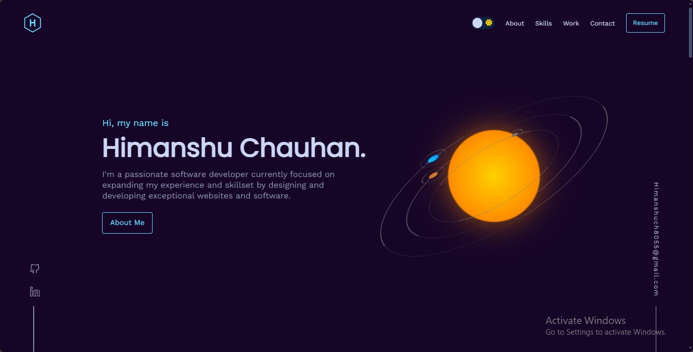

# Himanshu Chauhan | Software Developer Portfolio

  

## 🚀 Welcome to My Digital Showcase

Greetings! I'm Himanshu Chauhan, a passionate full-stack developer with a knack for transforming complex challenges into elegant, efficient solutions. This repository houses the source code for my professional portfolio website, offering a comprehensive look into my skills, projects, and journey through the dynamic landscape of software development.

## 🌐 Experience My Work

Explore my digital presence: [himanshuch8055.github.io](https://himanshuch8055.github.io)

## 🛠️ Technology Arsenal

## ✨ Distinctive Features

- 🎨 Sleek, modern aesthetic with attention to detail
- 📱 Fully responsive layout ensuring a seamless experience across all devices
- 🌓 Customizable dark/light mode for personalized viewing comfort
- 🖼️ Dynamic project showcase with interactive elements to highlight key works
- 📊 Visual representation of skill set and expertise for quick assessment
- 📬 Integrated contact form for effortless communication

## 🗂️ Project Architecture

The project is meticulously organized as follows:

- `Himanshuch8055.github.io/`: Core source code for the website.
  - `img/`: Directory containing images and visual assets used throughout the site.
  - `script/`: JavaScript files for interactive functionality and dynamic content.
  - `style/`: CSS stylesheets for layout and design, including responsive styles.
  - `index.html`: The main HTML file serving as the entry point for the website.

## 🤝 Collaboration and Contributions

I enthusiastically welcome contributions and suggestions to enhance this project. Feel free to open an issue for discussions or submit a pull request with your improvements.

## 📄 Licensing

This project is open-source and available under the MIT License. For full details, please refer to the [LICENSE](LICENSE) file.
